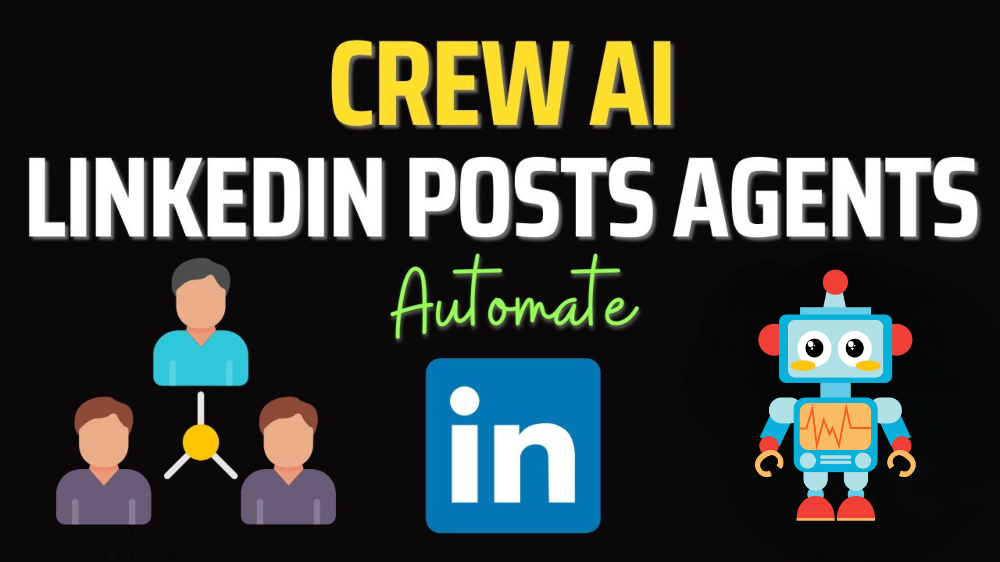

<h1 align="center">CrewAI Job Finder in Linkedin 💼</h1>

  
 

<h2>Job Search</h2>

<pre>
Entering new CrewAgentExecutor chain...

Thought: Do I need to use a tool? Yes
Action: Delegate work to co-worker
Action Input: Job Searcher|Search for current job openings|{'role': 'Senior Data Scientist', 'location': 'New York', 'num_results': 5}

// The tool accepts input in JSON format with the following schema:
{
  'role': '&lt;role&gt;',
  'location': '&lt;location&gt;',
  'num_results': &lt;number&gt;
}
// Ensure to format the input accordingly.
</pre>

Results:

<ul>
  <li>
    <b>Company:</b> InVitro Cell Research, LLC
     <b>Location:</b> Leonia, Bergen County
     <b>Description:</b> Hiring Senior Data Scientists with expertise in integrating and analyzing multi-omic datasets.
  </li>
  <li>
    <b>Company:</b> Fingerprint For Success
     <b>Location:</b> Manhattan, New York City
     <b>Description:</b> Inviting professionals in high-growth industries thinking about their next move or looking to transition into the field of data science.
  </li>
  <li>
    <b>Company:</b> Curinos
     <b>Location:</b> New York City, New York
     <b>Description:</b> Looking for an experienced applied Senior Data Scientist to join our Data Science team.
  </li>
  <li>
    <b>Company:</b> Chubb
     <b>Location:</b> Hudson County, New Jersey
     <b>Description:</b> Seeking an experienced Senior Data Scientist for our North America Property and Casualty Data Analytics Division.
  </li>
  <li>
    <b>Company:</b> Informa
     <b>Location:</b> Church Street, Manhattan
     <b>Description:</b> Curinos is looking for an experienced applied Senior Data Scientist to join our Data Science & Machine Learning team.
  </li>
</ul>

<h2>Skills Development</h2>

Thought: Do I need to use a tool? Yes

Action: Delegate work to co-worker

Action Input: Skills Development Advisor|recommend courses and self-study materials|The job openings we found require skills in integrating and analyzing multi-omic datasets, high-growth industry knowledge, applied data science experience, machine learning, and industry-specific data science applications. We need recommendations on how candidates can acquire or improve these skills through courses, self-study, or practical experience.

Results:

<h3>Integrating and Analyzing Multi-Omic Datasets</h3>

<ul>
  <li>
    <b>Courses:</b> Look for bioinformatics or computational biology courses available on platforms like Coursera, edX, or Udemy. Specifically, courses that cover genomics, proteomics, and their integration methods will be highly beneficial.
  </li>
  <li>
    <b>Self-Study Materials:</b> Review academic and industry publications in journals like Bioinformatics, Nature Methods, or the Journal of Proteomics & Bioinformatics to understand current trends and methodologies.
  </li>
  <li>
    <b>Practical Experience:</b> Participate in open-source projects or Kaggle competitions related to bioinformatics. This hands-on experience is invaluable.
  </li>
</ul>

<h3>High-Growth Industry Knowledge</h3>

<ul>
  <li>
    <b>Courses:</b> Business and technology-focused courses that provide insights into emerging markets and technologies. Platforms like LinkedIn Learning and Coursera offer industry-specific insights and trends courses.
  </li>
  <li>
    <b>Self-Study Materials:</b> Regularly read industry reports from McKinsey, BCG, or specific industry publications like TechCrunch for technology sectors. Podcasts and webinars by industry leaders can also provide current insights.
  </li>
  <li>
    <b>Practical Experience:</b> Networking with professionals in the industry through platforms like LinkedIn, attending webinars, and participating in industry forums can provide real-world knowledge and trends.
  </li>
</ul>

<h3>Applied Data Science Experience</h3>

<ul>
  <li>
    <b>Courses:</b> Data science bootcamps or courses that focus on real-world applications of data science, including project-based learning. Check platforms like DataCamp, Coursera, and edX.
  </li>
  <li>
    <b>Self-Study Materials:</b> Work through datasets available on platforms like Kaggle or GitHub, applying different data science techniques and documenting your findings and methodologies in a portfolio.
  </li>
  <li>
    <b>Practical Experience:</b> Freelance projects or internships where you can apply data science skills in real-world scenarios.
  </li>
</ul>

<h3>Machine Learning</h3>

<ul>
  <li>
    <b>Courses:</b> Look for machine learning courses that offer both foundational understanding and advanced techniques. Andrew Ng’s Machine Learning course on Coursera is highly recommended.
  </li>
  <li>
    <b>Self-Study Materials:</b> Books like "Hands-On Machine Learning with Scikit-Learn, Keras, and TensorFlow" by Aurélien Géron provide comprehensive guides to practical machine learning.
  </li>
  <li>
    <b>Practical Experience:</b> Implement machine learning models to solve problems on Kaggle. This provides both experience and a portfolio to show potential employers.
  </li>
</ul>

<h3>Industry-Specific Data Science Applications</h3>

<ul>
  <li>
    <b>Courses:</b> Seek out courses that focus on the application of data science in specific industries, such as healthcare, finance, or marketing.
  </li>
  <li>
    <b>Self-Study Materials:</b> Industry-specific case studies and datasets can help understand how data science is applied uniquely in each sector.
  </li>
  <li>
    <b>Practical Experience:</b> Try to engage in projects or competitions that are industry-specific to gain relevant experience.
  </li>
</ul>

Remember, the combination of courses, self-study, and practical experience not only enhances learning but also significantly improves employability by demonstrating both knowledge and practical skills to potential employers.

<h2>Networking</h2>

Thought: Do I need to use a tool? Yes

Action: Delegate work to co-worker

Action Input: Networking Advisor|suggest networking strategies|Based on the job openings and skills development recommendations

Action Input: Networking Advisor|suggest networking strategies|Based on the job openings and skills development recommendations, we need advice on how to network effectively in the industry to increase chances of getting hired.

Results:

<h3>Networking Strategies</h3>

<ul>
  <li>
    <b>Attend Industry Events:</b> Look for conferences, meetups, and webinars related to data science and the specific industries you're interested in. This provides opportunities to meet professionals and learn about new developments.
  </li>
  <li>
    <b>Join Online Communities:</b> Participate in forums like Kaggle, Reddit (r/MachineLearning and r/DataScience), and Stack Overflow to engage with other data science professionals, ask questions, and share knowledge.
  </li>
  <li>
    <b>Utilize LinkedIn:</b> Leverage LinkedIn to connect with professionals in your desired field, join relevant groups, and participate in discussions. Ensure your profile is up-to-date and showcases your skills and experience.
  </li>
  <li>
    <b>Reach Out to Professionals:</b> Don't hesitate to contact professionals directly via LinkedIn or email to ask for advice or discuss potential opportunities. Personal connections can lead to valuable insights and job leads.
  </li>
</ul>

By following these strategies, you can effectively network within the industry, increasing your visibility and chances of securing a job that matches your skills and interests.

<h2>Resume Building</h2>

Thought: Do I need to use a tool? Yes

Action: Delegate work to co-worker

Action Input: Resume Builder|create a resume based on job requirements|Using the insights from job openings and skills development, we need a resume that highlights relevant skills and experiences tailored to the Senior Data Scientist positions.

Results:

<h3>Resume Template</h3>

<pre>
[Your Name]
[Address]
[Phone Number]
[Email]

Objective:
To secure a challenging Senior Data Scientist position that utilizes my skills in data analysis, machine learning, and industry-specific applications to drive business growth.

Summary:
Highly motivated Senior Data Scientist with [Number] years of experience in data analysis, machine learning, and industry-specific data science applications. Proven track record of delivering insights that drive business decisions. Skilled in integrating and analyzing multi-omic datasets, with expertise in Python, R, and SQL.

Education:
- [Degree], [Field of Study], [University], [Graduation Date]
- [Relevant Coursework or Specializations]

Technical Skills:
- Programming Languages: Python, R, SQL
- Data Analysis and Machine Learning Libraries: Pandas, NumPy, Scikit-learn, TensorFlow
- Operating Systems: Windows, Linux
- Data Visualization Tools: Matplotlib, Seaborn, Plotly

Professional Experience:
[Company Name], [Job Title], [Employment Dates]
- [Brief Description of Job Responsibilities]
- [Key Achievements and Impact]

Projects:
[Project Name], [Project Dates]
- [Brief Description of Project]
- [Technologies Used]
- [Key Findings and Outcomes]

Certifications/Awards:
[List any relevant certifications or awards]

References:
Available upon request.
</pre>

Customize this template with your specific experiences, skills, and achievements to create a compelling resume that showcases your value as a Senior Data Scientist.

<h2>Interview Preparation</h2>

Thought: Do I need to use a tool? Yes

Action: Delegate work to co-worker

Action Input: Interview Prep Advisor|prepare for common interview questions|With a tailored resume, we now need to prepare for common interview questions and topics related to Senior Data Scientist positions.

Results:

<h3>Common Interview Questions</h3>

<ul>
  <li>
    <b>Can you explain the concept of [Technical Term] and how it's applied in data science?</b>
     Be prepared to define technical terms and provide examples of their application.
  </li>
  <li>
    <b>How do you handle missing data in a dataset?</b>
     Discuss strategies for dealing with missing data, such as imputation, interpolation, or deletion.
  </li>
  <li>
    <b>What machine learning algorithms are you familiar with, and how do you choose the right one for a problem?</b>
     Review common machine learning algorithms and be prepared to discuss their strengths, weaknesses, and appropriate use cases.
  </li>
  <li>
    <b>Can you walk me through your process for analyzing a complex dataset?</b>
     Outline your approach to data analysis, including data cleaning, feature engineering, model selection, and interpretation of results.
  </li>
</ul>

Prepare thoughtful questions to ask the interviewer about the company, the role, and future projects. This demonstrates your interest in the position and your willingness to learn.

By following these steps and utilizing the provided tools and resources, you'll be well-prepared to find and secure a Senior Data Scientist position that matches your skills and interests.

